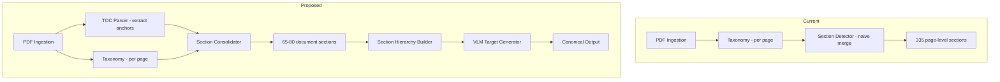
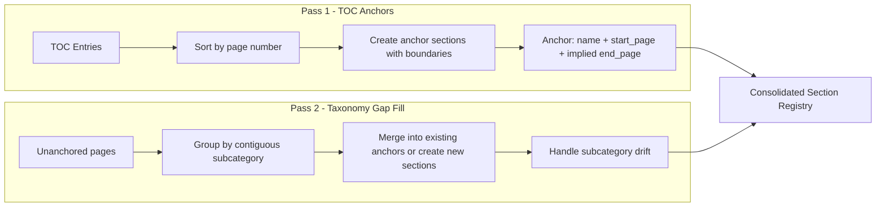
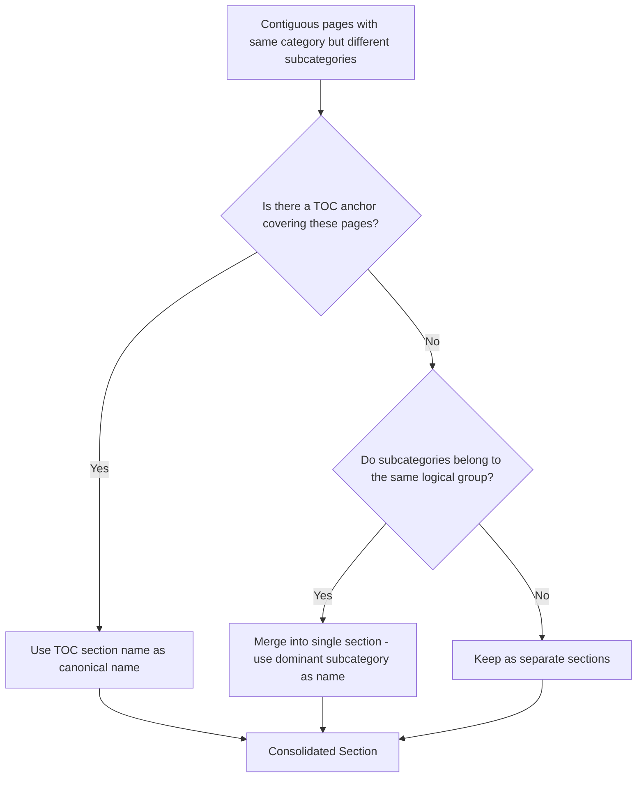

# Section Consolidation & Production Readiness Plan

## Executive Summary

The current extraction framework produces **335 page-level taxonomy mappings** instead of **65-80 logical document sections**. This is the single biggest architectural gap preventing production readiness. This plan addresses the four phases identified in the architectural review, with **Section Consolidation** as the highest-priority item.

---

## Root Cause Analysis

### Why 335 mappings instead of 65-80 sections?

The current flow is:

```
PDF → pdf_ingestion (per-page) → taxonomy.classify_pages (per-page) → section_detector.build_master_sections
```

The problem is in [`section_detector.build_master_sections()`](graph/sources/annual_report/section_detector.py:34):

1. **It only merges adjacent pages with identical `category` AND `subcategory`** — line 82: `if current_section["category"] == category and current_section["section_name"] == subcategory`
2. **It has no awareness of TOC boundaries** — the [`toc_parser.py`](graph/sources/annual_report/toc_parser.py:1) already extracts section names and page numbers, but this data is **never fed into the section detector**
3. **Taxonomy classification is noisy** — the LLM/regex classifier assigns slightly different subcategories to pages within the same logical section (e.g., page 16 = "Business Performance Review", page 17 = "Operational Review", page 18 = "Financial Review" — all within MD&A)
4. **No concept of section boundaries** — the system treats each page independently

### Why table inventory has false positives?

[`table_detector.detect_tables()`](graph/sources/annual_report/table_detector.py:140) matches keyword patterns per-page without considering **document context**. A KPI highlights table on page 4 matches "profit" and "revenue" keywords and gets classified as `profit_and_loss`, even though actual financial statements start on page 75+.

---

## Target Architecture



---

## Phase 1: Section Consolidator

### The Core Algorithm

The consolidator takes two inputs:
1. **TOC anchors** — from [`toc_parser.parse_toc_for_page_hints()`](graph/sources/annual_report/toc_parser.py:274), which already extracts `TocEntry` objects with `description` and `page_number`
2. **Taxonomy mappings** — from [`taxonomy.classify_pages()`](graph/sources/annual_report/taxonomy.py:458), the per-page category/subcategory assignments



### Pass 1: TOC-Driven Anchor Sections

The TOC provides **natural section boundaries**. For a report with TOC:

```
About the Company .......... Page 2
Business Verticals .......... Page 6
Letter to Shareholders ..... Page 8
MD&A ....................... Page 16
Corporate Governance ....... Page 51
Financial Statements ....... Page 75
```

Each TOC entry becomes an anchor section where:
- `start_page` = TOC page number (adjusted for offset)
- `end_page` = next TOC entry's start_page - 1

This immediately gives us correct boundaries without any classification.

**New module:** `graph/sources/annual_report/section_consolidator.py`

```python
@dataclass
class ConsolidatedSection:
    section_id: str
    section_name: str           # Canonical name from TOC or taxonomy
    category: str               # Taxonomy category
    subcategory: str            # Taxonomy subcategory
    start_page: int
    end_page: int
    content_type: str           # "text" | "table" | "mixed"
    extraction_strategy: str    # "pdf_text" | "vlm" | "hybrid"
    confidence: float
    source: str                 # "toc" | "taxonomy" | "merged"
    toc_entry: str | None       # Original TOC description if available
    page_count: int             # end_page - start_page + 1
```

### Pass 2: Taxonomy Gap Fill

Pages not covered by any TOC anchor need to be assigned to sections. This happens when:
- The TOC is incomplete or missing
- Pages exist between TOC sections that werent listed
- The TOC parser failed to extract some entries

Algorithm:
1. Identify all pages NOT covered by TOC anchors
2. Group contiguous unanchored pages by their dominant taxonomy subcategory
3. For each group:
   - If it sits between two TOC anchors, assign it to the preceding anchor if the taxonomy subcategory is compatible
   - If it represents a new section, create a new section entry
4. Handle **subcategory drift**: pages 16-22 might be classified as "Business Performance Review", "Operational Review", "Financial Review" — all under "Management Discussion & Analysis" category. These should be merged into one MD&A section.

### Subcategory Drift Resolution

This is the hardest problem. The solution:



**Logical grouping rules** — subcategories that should merge under the same parent:

| Category | Merge Group | Subcategories that merge |
|----------|------------|------------------------|
| Management Discussion & Analysis | MD&A | Industry Overview, Business Performance Review, Operational Review, Financial Review, Segment Performance, Key Performance Indicators, Internal Controls, Opportunities & Threats |
| Company Information | Company Profile | Company Profile, Business Overview, Corporate Identity, Registered Office, Key Milestones |
| Management & Governance | Corp Gov | Board of Directors, Board Committees, Key Managerial Personnel, Corporate Governance Report, Code of Conduct |
| Financial Statements | Financials | All Standalone/Consolidated statement subcategories |
| Notes to Accounts | Notes | All note subcategories |

### Integration Point

The consolidator replaces the current [`build_master_sections()`](graph/sources/annual_report/section_detector.py:34) call in the pipeline. The existing function stays as a fallback for when no TOC is available.

**Updated pipeline flow in [`extraction_pipeline.py`](graph/sources/annual_report/extraction_pipeline.py:44):**

```python
# Layer 3.5: Section Consolidation (replaces naive section detection)
from .section_consolidator import consolidate_sections
from .toc_parser import parse_toc_for_page_hints

# Parse TOC first
toc_hints = parse_toc_for_page_hints(pdf_path, pages=all_pages)

# Consolidate using TOC anchors + taxonomy
master_sections = consolidate_sections(
    toc_hints=toc_hints,
    taxonomy_mappings=taxonomy_mappings,
    all_pages=all_pages,
    progress_callback=progress_callback,
)
```

---

## Phase 2: Section Hierarchy

### Schema Changes

Update [`MasterSection`](graph/sources/annual_report/schemas.py:45) in `schemas.py`:

```python
class MasterSection(BaseModel):
    section_id: str
    section_name: str
    category: str               # Parent category from taxonomy
    subcategory: str            # Leaf-level subcategory
    start_page: int
    end_page: int
    content_type: str
    extraction_strategy: str
    confidence: float
    # NEW fields
    parent_section_id: str | None = None    # Link to parent section
    child_section_ids: list[str] = []       # Child sections
    level: int = 0                          # 0 = top, 1 = child, etc.
    source: str = "taxonomy"                # "toc" | "taxonomy" | "merged"
```

### SQLite Schema Changes

Update [`master_data.py`](graph/sources/annual_report/master_data.py:102) `master_sections` table:

```sql
CREATE TABLE IF NOT EXISTS master_sections (
    section_id TEXT PRIMARY KEY,
    section_name TEXT,
    category TEXT,
    subcategory TEXT,
    start_page INTEGER,
    end_page INTEGER,
    content_type TEXT,
    extraction_strategy TEXT,
    confidence REAL,
    parent_section_id TEXT,          -- NEW
    level INTEGER DEFAULT 0,         -- NEW
    source TEXT DEFAULT 'taxonomy',  -- NEW
    page_count INTEGER DEFAULT 1,    -- NEW
    FOREIGN KEY (parent_section_id) REFERENCES master_sections(section_id)
);
```

### Hierarchy Builder

New function in `section_consolidator.py`:

```python
def build_section_hierarchy(
    sections: list[ConsolidatedSection],
) -> list[ConsolidatedSection]:
    """Organize flat sections into parent-child hierarchy.
    
    Top-level sections are the 17 taxonomy categories.
    Child sections are the actual document sections.
    """
```

Output structure:

```json
{
  "Company Information": [
    {"section_name": "Company Profile", "start_page": 5, "end_page": 8},
    {"section_name": "Business Overview", "start_page": 9, "end_page": 10}
  ],
  "Management & Governance": [
    {"section_name": "Board of Directors", "start_page": 23, "end_page": 25},
    {"section_name": "Directors Report", "start_page": 26, "end_page": 40}
  ],
  "Financial Statements": [
    {"section_name": "Standalone Balance Sheet", "start_page": 81, "end_page": 81},
    {"section_name": "Standalone Profit & Loss", "start_page": 82, "end_page": 83}
  ]
}
```

---

## Phase 3: VLM Target Generator

### Priority Classification

Not all sections need VLM. The generator auto-identifies which sections require VLM extraction based on:

| Priority | Condition | Examples |
|----------|-----------|---------|
| HIGH | `content_type == table` AND `table_category == financial_statement` | Balance Sheet, P&L, Cash Flow, Changes in Equity |
| HIGH | `content_type == table` AND `table_category == shareholding_table` | Shareholding Pattern |
| MEDIUM | `content_type == table` AND `table_category == related_party_table` | Related Party Transactions |
| MEDIUM | `content_type == mixed` AND high numeric density | Notes with embedded tables |
| LOW | `content_type == text` | Directors Report, MD&A text |

### New Module: `graph/sources/annual_report/vlm_targets.py`

```python
@dataclass
class VLMTarget:
    section_id: str
    section_name: str
    priority: str               # "high" | "medium" | "low"
    table_category: str         # "financial_statement" | "kpi_table" | etc.
    page_range: tuple[int, int]
    extraction_prompt: str      # VLM prompt template for this table type
    estimated_pages: int

def generate_vlm_targets(
    master_sections: list[dict],
    table_inventory: list[dict],
) -> list[VLMTarget]:
    """Auto-generate VLM extraction targets from section registry + table inventory."""
```

### Integration

In [`extraction_pipeline.py`](graph/sources/annual_report/extraction_pipeline.py:165), replace the current hardcoded VLM routing with:

```python
# Layer 5/6: VLM Target Routing
from .vlm_targets import generate_vlm_targets

vlm_targets = generate_vlm_targets(master_sections, detected_tables)

for target in vlm_targets:
    if target.priority in ("high", "medium"):
        # Route to VLM extractor
        ...
```

---

## Phase 4: Canonical Output Schema

### Current Output (fragmented)

```python
result = {
    "metadata": metadata,
    "master_sections": master_sections,       # flat list
    "table_inventory": detected_tables,       # per-page entries
    "taxonomy_mappings": taxonomy_mappings,   # 335 page-level mappings
    "text_extractions": text_extractions,
    "table_extractions": table_extractions,
    "validation_report": validation_report,
    "standalone": legacy_result["standalone"],
    "consolidated": legacy_result["consolidated"],
}
```

### Proposed Canonical Output

```python
class DocumentRegistry(BaseModel):
    """Canonical output schema for the extraction pipeline."""
    metadata: dict[str, Any]
    section_registry: SectionRegistry
    table_inventory: TableInventory
    taxonomy: TaxonomySummary
    extractions: ExtractionResults
    quality_report: QualityReport

class SectionRegistry(BaseModel):
    """Hierarchical section registry."""
    total_sections: int
    toc_sections: int               # Sections derived from TOC
    taxonomy_sections: int          # Sections derived from taxonomy only
    hierarchy: dict[str, list[MasterSection]]  # category → children
    flat: list[MasterSection]       # Flat list for backward compat

class TableInventory(BaseModel):
    """Classified table inventory."""
    total_tables: int
    by_category: dict[str, list[TableInventoryItem]]  # category → items
    vlm_required: list[TableInventoryItem]
    all_items: list[TableInventoryItem]

class TaxonomySummary(BaseModel):
    """Summarized taxonomy — not 335 per-page mappings."""
    categories_found: list[str]
    coverage_pct: float
    page_mappings: list[TaxonomyMapping]  # Still available but not primary

class QualityReport(BaseModel):
    """Extraction quality metrics."""
    section_consolidation_ratio: float  # e.g., 335 → 72 = 0.215
    toc_coverage_pct: float             # % of sections anchored by TOC
    taxonomy_coverage_pct: float        # % of pages classified
    table_false_positive_rate: float    # Estimated FP rate
    vlm_target_count: int
    high_priority_vlm_targets: int
    issues: list[ValidationIssue]
    overall_score: float                # 0-10 composite score
```

---

## Phase 5: Table Inventory Improvement

### New `table_category` Classification

Add to [`table_detector.py`](graph/sources/annual_report/table_detector.py:37):

```python
class TableCategory(str, Enum):
    FINANCIAL_STATEMENT = "financial_statement"    # BS, P&L, CF, SOCE
    KPI_TABLE = "kpi_table"                        # Financial highlights, ratios
    SHAREHOLDING_TABLE = "shareholding_table"      # Shareholding pattern
    NOTE_TABLE = "note_table"                      # Tables within notes
    RELATED_PARTY_TABLE = "related_party_table"    # RPT disclosures
    RATIO_TABLE = "ratio_table"                    # Key financial ratios
    SEGMENT_TABLE = "segment_table"                # Segment information
    SCHEDULE_TABLE = "schedule_table"              # Schedules to financial statements
    OTHER = "other"                                # Miscellaneous tables
```

### False Positive Reduction

Current problem: Page 4 has "Revenue", "EBITDA", "PAT" in a highlights table → classified as `profit_and_loss`.

Fix: Add **context-aware filtering**:

1. **Page range check**: If the TOC says financial statements start at page 75, ignore `profit_and_loss` matches before page 70
2. **Table structure check**: A KPI highlights table has few rows and is summary-level; a real P&L has many line items
3. **Cross-reference with section registry**: If the page belongs to "Financial Highlights" section, the table is a `kpi_table`, not `financial_statement`

```python
def _classify_table_category(
    table_type: str,
    page_number: int,
    section_registry: list[dict],
    toc_hints: dict | None = None,
) -> TableCategory:
    """Classify a detected table into a refined category using context."""
```

### Schema Update

Update [`TableInventoryItem`](graph/sources/annual_report/schemas.py:69):

```python
class TableInventoryItem(BaseModel):
    table_id: str
    table_name: str
    table_category: str          # NEW: TableCategory value
    page_no: int
    complexity_score: float = 0.0
    needs_vlm: bool = False
    parent_section_id: str | None = None  # NEW: Link to section registry
```

---

## Implementation Order

```mermaid
gantt
    title Implementation Phases
    dateFormat X
    axisFormat %s

    section Phase 1 - Section Consolidator
    Create section_consolidator.py          :p1a, 0, 1
    TOC-driven anchor resolution            :p1b, 1, 2
    Taxonomy gap-fill with drift handling   :p1c, 2, 3
    Update extraction_pipeline.py           :p1d, 3, 4

    section Phase 2 - Section Hierarchy
    Update schemas.py                       :p2a, 4, 5
    Update master_data.py SQLite            :p2b, 5, 6
    Build hierarchy builder                 :p2c, 6, 7

    section Phase 5 - Table Inventory
    Add TableCategory enum                  :p5a, 7, 8
    Context-aware table classification      :p5b, 8, 9
    Update schemas and SQLite               :p5c, 9, 10

    section Phase 3 - VLM Targets
    Create vlm_targets.py                   :p3a, 10, 11
    Integrate into pipeline                 :p3b, 11, 12

    section Phase 4 - Canonical Output
    Update schemas.py with new models       :p4a, 12, 13
    Update extraction_pipeline.py output    :p4b, 13, 14
    Add quality metrics                     :p4c, 14, 15
```



**Phase 1 is the critical path** — everything else depends on having a correct section registry first.

---

## Files to Create/Modify

| File | Action | Phase |
|------|--------|-------|
| `graph/sources/annual_report/section_consolidator.py` | **CREATE** | 1 |
| `graph/sources/annual_report/section_detector.py` | Modify — keep as fallback | 1 |
| `graph/sources/annual_report/extraction_pipeline.py` | Modify — integrate consolidator | 1 |
| `graph/sources/annual_report/schemas.py` | Modify — add hierarchy fields, new models | 2, 4 |
| `graph/sources/annual_report/master_data.py` | Modify — update SQLite schema | 2 |
| `graph/sources/annual_report/vlm_targets.py` | **CREATE** | 3 |
| `graph/sources/annual_report/table_detector.py` | Modify — add TableCategory, context filtering | 5 |
| `graph/sources/annual_report/validation_engine.py` | Modify — add quality metrics | 4 |
| `graph/sources/annual_report/toc_parser.py` | Modify — expose raw entries for consolidator | 1 |

---

## Success Metrics

| Metric | Current | Target |
|--------|---------|--------|
| Section count | 335 | 65-80 |
| TOC-anchored sections | 0% | >60% |
| Table false positive rate | ~30% | <10% |
| VLM routing accuracy | Manual | Auto-generated |
| Output structure | Flat lists | Hierarchical registry |
| Quality score | N/A | Computed 0-10 |
