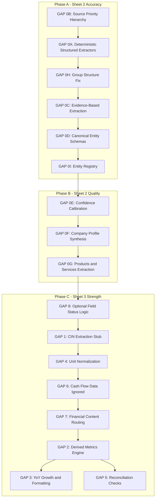

# Sprint 2 Implementation Plan: Full 47-Parameter Extraction
## Reprioritized with Sheet 2 (Intelligence Report) Fixes

### Document Version: 3.0
### Updated: 2026-07-15 — Incorporates all GPT-5.6 review revisions (8 revisions applied)

---

## Executive Summary

The Sprint 2 code skeleton is **structurally complete** — all 47 valuation targets, alias mappings, traceability maps, and the Excel builder are in place. However, two categories of gaps exist:

1. **Sheet 2 failures** — The Intelligence Report has critical entity extraction and source-selection bugs that produce incorrect or missing data for Board, KMP, Dividend, Subsidiaries, and Company Profile fields.
2. **Sheet 3 gaps** — The Valuation Counterpart lacks derived metrics, YoY formatting, unit normalization, and reconciliation checks.

Per the architectural review, **Sheet 2 fixes are higher priority** because the observed failures are entity extraction and source-selection problems, not financial-calculation problems. This plan is reprioritized into three phases:

- **Phase A** — Fix Sheet 2 accuracy (highest ROI)
- **Phase B** — Improve Sheet 2 quality further
- **Phase C** — Strengthen Sheet 3 (original Sprint 2 gaps)

**Critical rule:** Do not begin Phase C until Phase A is complete and Rajesh Exports regression tests pass.

---

## Current State Assessment

### What IS Working

| Component | File | Status |
|-----------|------|--------|
| 47 `VALUATION_TARGETS` defined | `workbook_population.py:56-110` | ✅ Complete |
| `VALUATION_LINE_ALIASES` regex patterns | `workbook_population.py:119-248` | ✅ Complete |
| `TRACEABILITY_MAP` for all 47 fields | `workbook_population.py:256-545` | ✅ Complete |
| `INTEL_TRACEABILITY` for 16 narrative fields | `workbook_population.py:552-649` | ✅ Complete |
| `_match_line_item` regex matcher | `workbook_population.py:807-816` | ✅ Complete |
| `_extract_financial_value` VLM row matcher | `workbook_population.py:819-897` | ✅ Complete |
| `_extract_metadata_field` metadata extractor | `workbook_population.py:900-1115` | ⚠️ Partial — CIN is a stub |
| `populate_valuation_report` main function | `workbook_population.py:1118-1212` | ✅ Complete |
| Valuation Counterpart Excel sheet | `excel_builder.py:349-585` | ⚠️ Partial — no YoY formatting |
| Sprint 2 content extractors | `content_extractor.py:318-427` | ✅ Complete |
| Integration test | `test_sprint2.py` | ✅ Works with mock data |

### Observed Sheet 2 Failures (Rajesh Exports)

| Field | Extracted | Expected | Root Cause |
|-------|-----------|----------|------------|
| Board of Directors | "P L VENKATADRI" only | Rajesh Mehta, Suresh Kumar, Prashant Sagar, Vijaya Lakshmi, Asha Mehta, Joseph T.D | LLM summary instead of structured extraction |
| KMP | NOT DISCLOSED | Akash Bhandari (CFO), B. Vijendra Rao (CS) | Wrong source section selected |
| Dividend | AGM agenda text | Dividend per share = 1 | Source priority — AGM Notice before Directors Report |
| Subsidiaries | NOT APPLICABLE | REL Singapore Pte Ltd | Hardcoded N/A instead of searching |
| Company Profile | Hallucinated incorporation year | Correct year from evidence | No evidence validation |

---

## Architecture Overview — All Gaps



---

# PHASE A: Sheet 2 Accuracy — Highest ROI

Expected Sheet 2 improvement: **65 → 85+**

**Gate:** Phase A is complete only when all Rajesh Exports regression tests pass.

---

## GAP 0B: Source Priority Hierarchy

### Problem

Many Sheet 2 extraction errors come from selecting the wrong source section. For example, Dividend is extracted from the AGM Notice instead of the Directors Report because the pipeline processes sections in page order and the first match wins.

Currently, [`extract_subcategory_content`](graph/sources/annual_report/content_extractor.py:35) processes whichever section text is passed to it — the caller in [`extraction_pipeline.py:292`](graph/sources/annual_report/extraction_pipeline.py:292) iterates `text_extractions` in arbitrary order and takes the first LLM result that returns non-None.

### Fix

**File:** `graph/sources/annual_report/source_routing.py` — **NEW FILE** *(Revision 1: moved from workbook_population.py for separation of concerns)*

1. Define `FIELD_SOURCE_PRIORITY` dictionary that specifies the preferred section search order for each Intelligence Report field:

```python
FIELD_SOURCE_PRIORITY: dict[str, list[str]] = {
    "Board of Directors": [
        "board of directors", "board structure", "directors profile",
        "corporate governance", "management discussion",
    ],
    "Key Management Personnel": [
        "key management personnel", "kmp", "corporate governance",
        "management discussion",
    ],
    "Board Committees": [
        "board committees", "audit committee", "corporate governance",
        "management discussion",
    ],
    "Corporate Governance": [
        "corporate governance", "governance report", "management discussion",
    ],
    "Share Capital": [
        "share capital", "balance sheet", "share capital note",
    ],
    "Shareholding Pattern": [
        "shareholding pattern", "shareholding", "corporate governance",
    ],
    "Major Shareholders": [
        "shareholding pattern", "shareholding", "corporate governance",
    ],
    "Dividend Information": [
        "directors report", "dividend", "financial statements",
        "notice", "agm",
    ],
    "Company Profile": [
        "company profile", "company overview", "about the company",
        "directors report",
    ],
    "Business Overview": [
        "business overview", "business review", "directors report",
        "management discussion",
    ],
    "Products & Services": [
        "products and services", "business overview", "directors report",
    ],
    "Subsidiaries & Group Structure": [
        "subsidiaries", "group structure", "subsidiary",
        "directors report", "annexure",
    ],
    "Industry Overview": [
        "industry overview", "management discussion", "directors report",
    ],
    "Business Review": [
        "business review", "performance review", "management discussion",
        "directors report",
    ],
    "Opportunities & Challenges": [
        "opportunities", "risk factors", "management discussion",
        "directors report",
    ],
    "Future Outlook": [
        "future outlook", "outlook", "management discussion",
        "directors report",
    ],
}
```

2. Create `select_best_source` function:

```python
def select_best_source(
    field_name: str,
    text_extractions: list[dict],
) -> dict | None:
    """Select the highest-priority source section for a given field.
    
    Searches text_extractions in the priority order defined by
    FIELD_SOURCE_PRIORITY. Returns the first matching extraction.
    """
    priorities = FIELD_SOURCE_PRIORITY.get(field_name, [])
    for priority_alias in priorities:
        for extraction in text_extractions:
            sub = extraction.get("subcategory", "").lower()
            cat = extraction.get("category", "").lower()
            if priority_alias in sub or priority_alias in cat:
                return extraction
    return None
```

**File:** `extraction_pipeline.py`

3. In the Layer 6.5 loop, restructure to use source priority:

```python
# Current: process every section in order
for extraction in text_extractions:
    extracted_json = extract_subcategory_content(category, subcategory, text_content, llm)

# New: for each target field, find best source then extract
from .source_routing import select_best_source, FIELD_SOURCE_PRIORITY
from .workbook_population import WORKBOOK_TARGETS

# Phase 1: Priority-driven extraction for known target fields
for cat, subcat in WORKBOOK_TARGETS:
    best_source = select_best_source(subcat, text_extractions)
    if best_source:
        extracted_json = extract_subcategory_content(
            best_source["category"], best_source["subcategory"],
            best_source["extracted_text"], llm
        )
        if extracted_json:
            if cat not in structured_intelligence:
                structured_intelligence[cat] = {}
            structured_intelligence[cat][subcat] = extracted_json

# Phase 2: Fallback — extract remaining sections not covered above
covered_subcats = {subcat for _, subcat in WORKBOOK_TARGETS}
for extraction in text_extractions:
    sub = extraction.get("subcategory", "")
    if sub not in covered_subcats:
        extracted_json = extract_subcategory_content(
            extraction["category"], sub,
            extraction["extracted_text"], llm
        )
        # ... store as before
```

---

## GAP 0A: Deterministic Structured Extractors *(Revision 2: renamed from "Governance")*

### Problem

The current extractors in [`content_extractor.py`](graph/sources/annual_report/content_extractor.py:120) rely entirely on LLM prompts. This causes incomplete extraction, hallucination, and inconsistency. The problem is broader than governance — it covers Directors, KMP, Committees, Dividend, Auditor, Share Capital, and Subsidiaries.

### Fix

**File:** `content_extractor.py`

1. Add **regex-based pre-extractors** that run BEFORE the LLM for all structured fields. These parse known table formats common in Indian annual reports:

```python
def _pre_extract_board_members(text: str) -> list[dict] | None:
    """Attempt regex-based extraction of board members before LLM fallback.
    
    Common patterns in Indian annual reports:
    - Tabular: "DIN: 0XXXXXXX | Name | Designation | Category"
    - List: "Shri/Smt/Ms Name, Designation (Category)"
    - Numbered: "1. Name ... Designation"
    """
    members = []
    
    # Pattern 1: DIN-based extraction (very high confidence)
    din_pattern = re.compile(
        r'(?:DIN[:\s]*)?(\d{8})\s*[|,\t]\s*'
        r'([A-Z][A-Za-z\s\.]+?)\s*[|,\t]\s*'
        r'([A-Za-z\s\.\-&]+?)\s*[|,\t]\s*'
        r'(Executive|Non-?Executive|Independent|Nominee|Alternate)',
        re.I
    )
    for match in din_pattern.finditer(text):
        members.append({
            "din": match.group(1),
            "name": match.group(2).strip(),
            "designation": match.group(3).strip(),
            "type": match.group(4).strip(),
            "extraction_method": "regex_din",
        })
    
    if members:
        return members
    
    # Pattern 2: Shri/Smt prefix
    name_pattern = re.compile(
        r'(?:Shri|Smt|Ms|Mr|Dr)\.?\s+([A-Z][A-Za-z\s\.]+?)(?:,|\s{2,})\s*'
        r'([A-Za-z\s\.\-&]+?)(?:\s*\((Independent|Non-?Executive|Executive|Nominee)\))?',
        re.I
    )
    for match in name_pattern.finditer(text):
        name = match.group(1).strip()
        if len(name) > 2 and not any(m["name"] == name for m in members):
            members.append({
                "name": name,
                "designation": match.group(2).strip(),
                "type": match.group(3).strip() if match.group(3) else "Not Specified",
                "extraction_method": "regex_name",
            })
    
    return members if members else None
```

2. Add similar pre-extractors for KMP, Committees, Subsidiaries, Dividend, and Auditor:

```python
def _pre_extract_kmp(text: str) -> list[dict] | None:
    """Regex-based KMP extraction."""
    kmp_list = []
    kmp_pattern = re.compile(
        r'(?:Shri|Smt|Ms|Mr|Dr)\.?\s+([A-Z][A-Za-z\s\.]+?)(?:,|\s*-\s*)'
        r'(Chief[\s-]?Financial\s+Officer|Company\s+Secretary|Managing\s+Director|CEO|CFO|CS|Whole[\s-]time\s+Director)',
        re.I
    )
    for match in kmp_pattern.finditer(text):
        kmp_list.append({
            "name": match.group(1).strip(),
            "designation": match.group(2).strip(),
            "extraction_method": "regex_kmp",
        })
    return kmp_list if kmp_list else None


def _pre_extract_committees(text: str) -> list[str] | None:
    """Regex-based committee name extraction."""
    committees = []
    committee_pattern = re.compile(
        r'(Audit\s+Committee|Nomination\s+and\s+Remuneration\s+Committee|'
        r'NRC|Stakeholders?\s*(?:Relationship\s+)?Committee|CSR\s+Committee|'
        r'Risk\s+Management\s+Committee|Vigilance\s+Committee|'
        r'Share\s+Transfer\s+Committee|Investor\s+Grievance\s+Committee)',
        re.I
    )
    for match in committee_pattern.finditer(text):
        name = match.group(0).strip()
        if name not in committees:
            committees.append(name)
    return committees if committees else None


def _pre_extract_subsidiaries(text: str) -> dict | None:
    """Regex-based subsidiary extraction from annexure tables."""
    subsidiaries = []
    sub_pattern = re.compile(
        r'(?:Sl\.?\s*No\.?|S\.?\s*No\.?)\s*\d+[\s.|,)\-]+'
        r'([A-Z][A-Za-z\s\.&\-]+(?:Ltd|Limited|Pte|LLC|Inc|GmbH|SA|AG))',
        re.I
    )
    for match in sub_pattern.finditer(text):
        name = match.group(1).strip()
        if len(name) > 5 and name not in subsidiaries:
            subsidiaries.append(name)
    return {"subsidiaries": subsidiaries} if subsidiaries else None


def _pre_extract_dividend(text: str) -> dict | None:
    """Regex-based dividend extraction — prioritized over LLM."""
    # Pattern 1: "Dividend of Rs. X.XX per share"
    div_pattern = re.compile(
        r'dividend\s+(?:of\s+)?(?:Rs\.?|INR)\s*([\d,]+\.?\d*)\s*(?:per\s+equity\s+share|per\s+share|/-)',
        re.I
    )
    match = div_pattern.search(text)
    if match:
        return {"dividend_declared": match.group(1), "extraction_method": "regex_dividend"}
    
    # Pattern 2: "X% dividend"
    pct_pattern = re.compile(r'(\d+)%\s*dividend', re.I)
    match = pct_pattern.search(text)
    if match:
        return {"dividend_declared": f"{match.group(1)}%", "extraction_method": "regex_dividend"}
    
    # Pattern 3: "Recommended a dividend of Rs./- X"
    rec_pattern = re.compile(
        r'recommend(?:ed|s|ing)?\s+(?:a\s+)?dividend\s+(?:of\s+)?(?:Rs\.?|INR)\s*([\d,]+\.?\d*)',
        re.I
    )
    match = rec_pattern.search(text)
    if match:
        return {"dividend_declared": match.group(1), "extraction_method": "regex_dividend"}
    
    return None


def _pre_extract_auditor(text: str) -> dict | None:
    """Regex-based auditor opinion extraction."""
    text_lower = text.lower()
    opinion = None
    if "unqualified" in text_lower or "true and fair" in text_lower:
        opinion = "Unqualified"
    elif "qualified" in text_lower and "except for" in text_lower:
        opinion = "Qualified"
    elif "adverse" in text_lower:
        opinion = "Adverse"
    elif "disclaimer" in text_lower:
        opinion = "Disclaimer"
    
    # Extract auditor firm name
    auditor_pattern = re.compile(
        r'(?:M/s\.?\s*)?([A-Z][A-Za-z\s\.&]+(?:Associates|Partners|Co\.|LLP|Chartered\s+Accountants))',
        re.I
    )
    match = auditor_pattern.search(text)
    auditor_name = match.group(1).strip() if match else None
    
    if opinion or auditor_name:
        result = {"extraction_method": "regex_auditor"}
        if opinion:
            result["auditor_opinion"] = opinion
        if auditor_name:
            result["auditor_name"] = auditor_name
        return result
    
    return None
```

3. Modify each existing LLM extractor to **try regex first, then fall back to LLM**:

```python
def _extract_board_of_directors(text: str, llm: Any) -> list:
    # Try deterministic extraction first
    pre_result = _pre_extract_board_members(text)
    if pre_result and len(pre_result) >= 2:
        return pre_result
    
    # Fall back to LLM
    result = _extract_json_from_llm(llm, prompt)
    if isinstance(result, list) and len(result) > 0:
        for item in result:
            item["extraction_method"] = "llm"
        return result
    return pre_result if pre_result else []
```

Apply the same pattern to: `_extract_kmp`, `_extract_committees`, `_extract_subsidiaries`, `_extract_dividend`, `_extract_auditor_report`.

---

## GAP 0H: Group Structure Extraction *(Revision 6: moved from Phase B to Phase A)*

### Problem

Subsidiaries extraction returns "NOT APPLICABLE" even when subsidiaries like REL Singapore Pte Ltd are disclosed. The hardcoded status logic in `populate_intelligence_report` marks this field as N/A regardless of extraction results.

### Fix

**File:** `workbook_population.py`

1. Remove the hardcoded "NOT APPLICABLE" for Subsidiaries in `populate_intelligence_report`:

```python
# Current (line 772-774):
if subcat == "Subsidiaries & Group Structure":
    status = "NOT APPLICABLE"
    extracted_value = "Not Disclosed / Not Applicable"

# Fixed:
# Remove this special case entirely. If no data found, use standard "NOT DISCLOSED"
# Only mark as "NOT APPLICABLE" if the company explicitly states "no subsidiaries"
```

2. Add logic to detect explicit "no subsidiaries" statements:

```python
if subcat == "Subsidiaries & Group Structure" and not extracted_value:
    # Search for explicit "no subsidiary" / "does not have any subsidiary" statements
    for k, v in flat_intel.items():
        if isinstance(v, dict):
            subs = v.get("subsidiaries", [])
            if subs == [] and v.get("no_subsidiaries_statement"):
                status = "NOT APPLICABLE"
                extracted_value = "Company has no subsidiaries as disclosed"
                break
    else:
        status = "NOT DISCLOSED"
        extracted_value = "No information found"
```

3. Enhance the `_extract_subsidiaries` function in `content_extractor.py` to also search for subsidiary names in the Directors Report and annexure sections using the `_pre_extract_subsidiaries` regex from GAP 0A.

---

## GAP 0C: Evidence-Based Extraction

### Problem

Current extraction output is just a value — no proof trail. When the Board extractor returns "P L VENKATADRI", there's no way to debug whether the LLM hallucinated or the source text was wrong.

### Fix

**File:** `content_extractor.py`

1. Define `ExtractionEvidence` and `EvidenceBackedResult` dataclasses:

```python
from dataclasses import dataclass, field

@dataclass
class ExtractionEvidence:
    """Evidence trail for an extracted value."""
    source_page: int | None = None
    source_section: str = ""
    source_text_snippet: str = ""   # Context around the match
    extraction_method: str = ""     # "regex_din", "regex_name", "llm", "heuristic"
    confidence: float = 0.0

@dataclass
class EvidenceBackedResult:
    """An extraction result with full evidence chain."""
    value: Any = None
    evidence: ExtractionEvidence = field(default_factory=ExtractionEvidence)
```

2. For regex extractors, capture **surrounding match context** *(Revision 5: not just text[:200])*:

```python
def _capture_evidence_snippet(text: str, match: re.Match, context_chars: int = 50) -> str:
    """Capture text surrounding a regex match for evidence.
    
    Takes 50 chars before and after the match to provide
    meaningful context for debugging.
    """
    start = max(match.start() - context_chars, 0)
    end = min(match.end() + context_chars, len(text))
    return text[start:end]
```

3. Modify each regex pre-extractor to use `_capture_evidence_snippet`:

```python
def _pre_extract_board_members(text: str, source_page: int | None = None, source_section: str = "") -> EvidenceBackedResult | None:
    members = []
    for match in din_pattern.finditer(text):
        members.append({...})
        snippet = _capture_evidence_snippet(text, match)
    
    if members:
        # Use first match snippet as representative evidence
        return EvidenceBackedResult(
            value=members,
            evidence=ExtractionEvidence(
                source_page=source_page,
                source_section=source_section,
                source_text_snippet=snippet,
                extraction_method="regex_din",
                confidence=0.95,
            )
        )
    return None
```

4. For LLM fallback extractors, set `extraction_method="llm"` and `confidence=0.7`.

**File:** `workbook_population.py`

5. Update `populate_intelligence_report` to consume `EvidenceBackedResult` objects and populate evidence columns:

```python
# In the report_rows.append call, add:
"evidence_method": result.evidence.extraction_method if hasattr(result, 'evidence') else "",
"evidence_snippet": result.evidence.source_text_snippet[:100] if hasattr(result, 'evidence') else "",
"evidence_page": result.evidence.source_page if hasattr(result, 'evidence') else None,
```

**File:** `excel_builder.py`

6. Add 3 new columns to the Intelligence Report sheet after the existing traceability columns:
   - "Evidence Method" — shows "regex_din", "regex_name", "llm", "heuristic"
   - "Evidence Snippet" — context around the match that produced the value
   - "Evidence Page" — specific page number if available

---

## GAP 0D: Canonical Entity Schemas

### Problem

Current output stores loosely-typed dicts. The Board extractor returns `list[dict]` but keys are inconsistent — sometimes `"type"`, sometimes `"category"`, sometimes missing. This makes downstream consumption unreliable.

### Fix

**File:** `content_extractor.py`

1. Define canonical Pydantic models for each entity type:

```python
from pydantic import BaseModel

class BoardMember(BaseModel):
    name: str
    designation: str = ""
    type: str = ""           # "Executive", "Non-Executive", "Independent"
    din: str = ""            # Director Identification Number
    appointment_date: str = ""
    source_page: int | None = None

class KMPEntry(BaseModel):
    name: str
    designation: str
    din: str = ""
    source_page: int | None = None

class CommitteeEntry(BaseModel):
    name: str
    chairperson: str = ""
    members_count: int | None = None
    meetings_held: int | None = None

class SubsidiaryEntry(BaseModel):
    name: str
    country: str = ""
    ownership_pct: float | None = None
    entity_type: str = ""    # "Subsidiary", "Associate", "Joint Venture"

class DividendEntry(BaseModel):
    dividend_per_share: str = ""
    dividend_pct: str = ""
    fiscal_year: str = ""
    declaration_date: str = ""

class AuditorEntry(BaseModel):
    auditor_name: str = ""
    auditor_opinion: str = ""
    key_audit_matters: list[str] = []
    emphasis_of_matter: str = ""
```

2. Modify each extractor to validate output against the canonical schema before returning:

```python
def _extract_board_of_directors(text: str, llm: Any) -> list[dict]:
    # ... regex or LLM extraction ...
    
    # Validate against canonical schema
    validated = []
    for member in raw_result:
        try:
            validated.append(BoardMember(**member).model_dump())
        except Exception:
            logger.warning(f"Board member schema validation failed: {member}")
            validated.append(member)
    
    return validated
```

3. Apply the same validation pattern to all structured extractors.

**File:** `workbook_population.py`

4. Update `_format_value` to handle the canonical schema fields properly — e.g., include DIN in the formatted Board output:

```python
if isinstance(value, list):
    for item in value:
        if isinstance(item, dict):
            name = item.get("name", "")
            designation = item.get("designation", "")
            typ = item.get("type", "")
            din = item.get("din", "")
            
            parts = []
            if name: parts.append(name)
            if designation: parts.append(designation)
            if typ: parts.append(f"({typ})")
            if din: parts.append(f"DIN: {din}")
            # ...
```

---

## GAP 0I: Entity Registry *(Revision 7: new gap)*

### Problem

As entity types grow, the codebase will develop an if/else explosion for type management, validation, and routing. A centralized registry prevents this.

### Fix

**File:** `content_extractor.py`

1. Create an `ENTITY_REGISTRY` that maps entity type names to their canonical Pydantic models:

```python
ENTITY_REGISTRY: dict[str, type[BaseModel]] = {
    "board_members": BoardMember,
    "kmp": KMPEntry,
    "committees": CommitteeEntry,
    "subsidiaries": SubsidiaryEntry,
    "dividend": DividendEntry,
    "auditor": AuditorEntry,
}
```

2. Create a generic `validate_entity_list` function:

```python
def validate_entity_list(entity_type: str, raw_items: list[dict]) -> list[dict]:
    """Validate a list of entity dicts against the canonical schema.
    
    Uses ENTITY_REGISTRY to find the right model.
    Logs validation failures but never drops data.
    """
    model_class = ENTITY_REGISTRY.get(entity_type)
    if not model_class:
        return raw_items
    
    validated = []
    for item in raw_items:
        try:
            validated.append(model_class(**item).model_dump())
        except Exception as exc:
            logger.warning(f"{entity_type} schema validation failed for {item}: {exc}")
            validated.append(item)
    
    return validated
```

3. Replace individual validation blocks in each extractor with:

```python
# Instead of:
validated = []
for member in raw_result:
    try:
        validated.append(BoardMember(**member).model_dump())
    except Exception:
        validated.append(member)

# Use:
validated = validate_entity_list("board_members", raw_result)
```

---

# PHASE B: Sheet 2 Quality Improvements

Expected Sheet 2 improvement: **85 → 90+**

**Gate:** Phase B begins only after Phase A regression tests pass.

---

## GAP 0E: Confidence Calibration

### Problem

Current confidence scores are unreliable — incorrect fields can receive 75-100% confidence while correct fields get similar scores. The scores come from the taxonomy classifier, not from extraction quality.

### Fix

**File:** `workbook_population.py`

1. Create `_compute_extraction_confidence` using **weighted average** *(Revision 3: replaced multiplicative formula)*:

```python
def _compute_extraction_confidence(
    extraction_result: Any,
    section_confidence: float,
    extraction_method: str,
    field_match_strength: float,
    evidence_count: int = 1,
) -> float:
    """Compute calibrated confidence using weighted average.
    
    Formula (weighted average, NOT multiplicative):
    confidence = 0.35 * section_confidence
               + 0.35 * quality
               + 0.20 * field_match_strength
               + 0.10 * evidence_factor
    
    Where:
    - section_confidence: from taxonomy/section classifier (0-1)
    - quality: regex=0.95, heuristic=0.85, llm=0.70
    - field_match_strength: exact=1.0, partial=0.7, fuzzy=0.4
    - evidence_factor: min(1.0, evidence_count / 3)
    
    Weighted average prevents confidence collapse that occurs
    with multiplicative scoring (e.g., 1.0 * 0.9 * 0.8 * 0.3 = 0.216).
    """
    EVIDENCE_QUALITY = {
        "regex_din": 0.95,
        "regex_name": 0.90,
        "regex_kmp": 0.90,
        "regex_dividend": 0.85,
        "regex_auditor": 0.85,
        "heuristic": 0.80,
        "llm": 0.70,
    }
    
    quality = EVIDENCE_QUALITY.get(extraction_method, 0.60)
    evidence_factor = min(1.0, evidence_count / 3)
    
    confidence = (
        0.35 * section_confidence
        + 0.35 * quality
        + 0.20 * field_match_strength
        + 0.10 * evidence_factor
    )
    
    return round(min(confidence, 1.0), 2)
```

2. In `populate_intelligence_report`, replace the raw section confidence with the calibrated confidence.

---

## GAP 0F: Company Profile Synthesis

### Problem

Company Profile extraction hallucinates incorporation year and fails to use higher-confidence evidence like CIN.

### Fix

**File:** `content_extractor.py`

1. Enhance `_extract_company_profile` to extract CIN and derive **registration year** *(Revision 4: NOT incorporation year — CIN year is registration year, not always incorporation year)*:

```python
def _extract_company_profile(text: str, llm: Any) -> dict:
    result = {}
    
    # Step 1: Extract CIN deterministically
    cin_match = re.search(r'U\d{5}[A-Z]{2}(\d{4})[A-Z]{3}\d{6}', text)
    if cin_match:
        result["cin"] = cin_match.group(0)
        result["registration_year"] = cin_match.group(1)  # Year from CIN
        result["registration_year_source"] = "cin_derived"
        # NOTE: Do NOT set incorporation_year from CIN.
        # CIN year = registration year, which may differ from incorporation year.
        # Only populate incorporation_year if explicitly stated in the text.
    
    # Step 2: Extract explicit incorporation year from text
    incorp_pattern = re.compile(
        r'(?:incorporated|incorporation)\s+(?:in\s+the\s+year\s+)?(?:of\s+)?(\d{4})',
        re.I
    )
    incorp_match = incorp_pattern.search(text)
    if incorp_match:
        result["incorporation"] = incorp_match.group(1)
        result["incorporation_source"] = "text_explicit"
    
    # Step 3: Extract registered office from address patterns
    office_pattern = re.compile(
        r'(?:registered\s+office|regd\.?\s+office|head\s+office)[:\s]*'
        r'([A-Z][A-Za-z\s,\.]+(?:Maharashtra|Karnataka|Tamil\s+Nadu|Gujarat|Rajasthan|Delhi|West\s+Bengal|Telangana|Andhra\s+Pradesh))',
        re.I
    )
    office_match = office_pattern.search(text)
    if office_match:
        result["registered_office"] = office_match.group(1).strip()
    
    # Step 4: LLM for remaining fields (business_description, certifications)
    # Only ask LLM for fields NOT already deterministically extracted
    llm_prompt = f"""... (exclude incorporation year and CIN if already found) ..."""
    llm_result = _extract_json_from_llm(llm, llm_prompt)
    if isinstance(llm_result, dict):
        # Merge: deterministic values override LLM values
        merged = {**llm_result, **result}
        return merged
    
    return result
```

---

## GAP 0G: Products & Services Extraction

### Problem

Products & Services extraction is too generic — the LLM prompt doesn't guide toward the specific product/service taxonomy common in Indian annual reports.

### Fix

**File:** `content_extractor.py`

1. Enhance the `_extract_products_services` prompt to be more specific:

```python
def _extract_products_services(text: str, llm: Any) -> dict:
    prompt = f"""You are analyzing the Products & Services section of an Indian company annual report.
Extract the following into a JSON object:
- "product_list": list of strings (specific product names, e.g., "TMT Bars", "Structural Steel", "Wire Rods")
- "service_list": list of strings (specific service names if any)
- "business_verticals": list of strings (e.g., "Steel", "Power", "Infrastructure")
- "key_customers": list of strings (if customer segments are mentioned, e.g., "Railways", "Construction")
- "revenue_by_vertical": dict mapping vertical name to revenue figure as string (if disclosed)

If a field is not found, use an empty list or null. Do NOT fabricate data.

Text:
{text}

Output JSON object:
"""
```

---

# PHASE C: Sheet 3 — Valuation Counterpart Strengthening

**Gate:** Phase C begins only after Phase A and B are complete and regression tests pass.

---

## GAP 8: Optional Field Status Logic

### Problem

All missing Optional fields marked "NOT APPLICABLE" — but most ARE applicable, just not required.

### Fix

**File:** `workbook_population.py`

1. Add `NOT_APPLICABLE_FIELDS` set for genuinely N/A fields.
2. Update status logic: "NOT APPLICABLE" only for fields in that set; all others default to "NOT DISCLOSED".

---

## GAP 1: CIN Extraction is a Stub

### Problem

In [`_extract_metadata_field`](graph/sources/annual_report/workbook_population.py:947), the CIN branch compiles the regex but does `pass` because `master_sections` doesn't carry raw page text.

### Fix

**File:** `workbook_population.py`

1. Add `raw_pages_text: dict[int, str]` parameter to `populate_valuation_report` and thread it to `_extract_metadata_field`.
2. In the CIN branch, iterate over `raw_pages_text` values and apply the regex. Return the first match.
3. Also search `structured_intelligence` for CIN as fallback.

**File:** `extraction_pipeline.py`

4. Build `raw_pages_text` from `store.get_all_pages()` and pass into `extraction_result`.

---

## GAP 4: Unit Normalization

### Problem

No normalization applied — "Rs. in Lakhs" values compared raw against "Rs. in Crores".

### Fix

**File:** `workbook_population.py`

1. Add `_normalize_to_crore` function with `UNIT_MULTIPLIERS` map.
2. Apply normalization to all numeric fields in `populate_valuation_report`.

**File:** `excel_builder.py`

3. Add "Unit Normalized" column showing "INR Crore" for normalized rows.

---

## GAP 6: Cash Flow Data Ignored

### Problem

`_extract_financial_value` only searches P&L and BS statement keys. Cash flow data is ignored.

### Fix

**File:** `workbook_population.py`

1. Expand `stmt_keys` mapping to include `cash_flow` for relevant Optional fields.
2. Add `CASH_FLOW_TARGETS` placeholder for Sprint 3.

---

## GAP 7: Financial Content Routing

### Problem

`content_extractor.py` skips all financial sections. Narrative context within financial sections is lost.

### Fix

**File:** `content_extractor.py`

1. Add `_extract_financials` and `_extract_notes_to_accounts` functions.
2. Add routing in `extract_subcategory_content`.

**File:** `extraction_pipeline.py`

3. Remove financial-category skip filter on line 298.

---

## GAP 2: Derived Metrics Engine

### Problem

The `engine_use` column references computed metrics like EBITDA, Net Debt, Capital Employed — but none are calculated.

### Required Derived Metrics

| Metric | Formula | Source Fields |
|--------|---------|---------------|
| EBITDA | Revenue - COGS - Employee Benefits - Other Expenses + Other Income | #9, #11, #12, #13, #14, #17, #10 |
| EBIT | EBITDA - D&A | EBITDA, #16 |
| Total Debt | LT Borrowings + ST Borrowings + Current Maturities of LT Debt | #22, #23, #24 |
| Net Debt | Total Debt - Cash & Cash Equivalents - Bank Balances / Current Investments | Total Debt, #25, #26 |
| Net Worth | Share Capital + Other Equity | #47, #21 |
| Capital Employed | Total Assets - Total Current Liabilities | #28, #27 |
| Working Capital | Total Current Assets - Total Current Liabilities | #44, #27 |
| Interest Coverage | EBIT / Finance Costs | EBIT, #15 |

### Fix

**File:** `workbook_population.py`

1. Add `DERIVED_METRICS` list and `_compute_derived_metrics` function.
2. In `populate_valuation_report`, after building all 47 rows, compute and append derived rows.

**File:** `excel_builder.py`

3. Add "Derived" group color palette and group separator row.

---

## GAP 3: YoY Growth Calculation and Conditional Formatting

### Problem

No YoY % change column exists. No Red/Green conditional formatting for growth/decline.

### Fix

**File:** `workbook_population.py`

1. Compute YoY % change for fields where `both_years == "Y"` and both values are valid numbers.
2. Add `yoy_change` and `yoy_direction` keys to each row dict.

**File:** `excel_builder.py`

3. Add YoY Change column (column 20).
4. Apply conditional formatting: green for growth, red for decline.

---

## GAP 5: Reconciliation Checks

### Problem

Cross-checks like PBT - Tax = PAT are referenced in `engine_use` but never implemented.

### Fix

**File:** `workbook_population.py`

1. Add `_run_reconciliation_checks` with `RECONCILIATION_RULES` and 2% tolerance.
2. Append reconciliation results to valuation report output.

**File:** `excel_builder.py`

3. Add Reconciliation section at bottom of Valuation Counterpart sheet.

---

# Implementation Order — Consolidated


| Step | Gap | File | Change Description |
|------|-----|------|-------------------|
| 1 | 0B | `source_routing.py` **NEW** | Add `FIELD_SOURCE_PRIORITY` dict and `select_best_source` function |
| 2 | 0B | `extraction_pipeline.py` | Restructure Layer 6.5 loop to use source priority |
| 3 | 0A | `content_extractor.py` | Add `_pre_extract_board_members`, `_pre_extract_kmp`, `_pre_extract_committees`, `_pre_extract_subsidiaries`, `_pre_extract_dividend`, `_pre_extract_auditor` |
| 4 | 0A | `content_extractor.py` | Modify each LLM extractor to try regex first, then fall back to LLM |
| 5 | 0H | `workbook_population.py` | Remove hardcoded N/A for Subsidiaries; add explicit no-subsidiary detection |
| 6 | 0H | `content_extractor.py` | Enhance `_extract_subsidiaries` with regex pre-extractor |
| 7 | 0C | `content_extractor.py` | Add `ExtractionEvidence`, `EvidenceBackedResult`, `_capture_evidence_snippet` |
| 8 | 0C | `content_extractor.py` | Modify all extractors to return `EvidenceBackedResult` |
| 9 | 0C | `workbook_population.py` | Update `populate_intelligence_report` to consume evidence |
| 10 | 0C | `excel_builder.py` | Add Evidence Method, Snippet, Page columns to Intelligence Report |
| 11 | 0D | `content_extractor.py` | Add canonical Pydantic models: `BoardMember`, `KMPEntry`, `CommitteeEntry`, `SubsidiaryEntry`, `DividendEntry`, `AuditorEntry` |
| 12 | 0D | `content_extractor.py` | Add schema validation to each extractor |
| 13 | 0D | `workbook_population.py` | Update `_format_value` to handle canonical schema fields |
| 14 | 0I | `content_extractor.py` | Add `ENTITY_REGISTRY` and `validate_entity_list` function |
| 15 | 0I | `content_extractor.py` | Replace individual validation blocks with `validate_entity_list` |
| 16 | 0E | `workbook_population.py` | Add `_compute_extraction_confidence` with weighted average formula |
| 17 | 0F | `content_extractor.py` | Enhance `_extract_company_profile` with CIN-derived registration year and address regex |
| 18 | 0G | `content_extractor.py` | Enhance `_extract_products_services` prompt |
| 19 | 8 | `workbook_population.py` | Add `NOT_APPLICABLE_FIELDS` set; fix status logic |
| 20 | 1 | `workbook_population.py` + `extraction_pipeline.py` | Implement CIN regex search with `raw_pages_text` |
| 21 | 4 | `workbook_population.py` + `excel_builder.py` | Add unit normalization and "Unit Normalized" column |
| 22 | 6 | `workbook_population.py` | Expand `_extract_financial_value` stmt_keys; add `CASH_FLOW_TARGETS` |
| 23 | 7 | `content_extractor.py` + `extraction_pipeline.py` | Add financial content routing; remove skip filter |
| 24 | 2 | `workbook_population.py` + `excel_builder.py` | Add `DERIVED_METRICS` and `_compute_derived_metrics`; add Derived group colors |
| 25 | 3 | `workbook_population.py` + `excel_builder.py` | Add YoY % change column and Red/Green conditional formatting |
| 26 | 5 | `workbook_population.py` + `excel_builder.py` | Add reconciliation checks and Reconciliation section |
| 27 | — | `test_sprint2.py` | Update test to cover all new functionality |
| 28 | — | `test_rajesh_exports_regression.py` **NEW** | Add Rajesh Exports regression tests *(Revision 8)* |

---

## Files Modified — Summary

| File | Gaps Addressed | Action | Est. Lines Added |
|------|---------------|--------|-----------------|
| `graph/sources/annual_report/source_routing.py` | 0B | **CREATE** | ~80 |
| `graph/sources/annual_report/workbook_population.py` | 0C, 0D, 0E, 0H, 1, 2, 3, 4, 5, 6, 8 | Modify | ~450 |
| `graph/sources/annual_report/excel_builder.py` | 0C, 2, 3, 4, 5 | Modify | ~200 |
| `graph/sources/annual_report/content_extractor.py` | 0A, 0C, 0D, 0F, 0G, 0I, 7 | Modify | ~500 |
| `graph/sources/annual_report/extraction_pipeline.py` | 0B, 1, 7 | Modify | ~40 |
| `test_sprint2.py` | All | Modify | ~100 |
| `test_rajesh_exports_regression.py` | Phase A gate | **CREATE** | ~80 |

---

## Rajesh Exports Regression Tests *(Revision 8)*

These tests are the **Phase A gate** — Phase B cannot begin until all pass.

**File:** `test_rajesh_exports_regression.py` — **NEW FILE**

```python
"""Rajesh Exports regression tests — Phase A gate.

These tests guard against the specific extraction failures
observed in the Rajesh Exports annual report.
"""

# Board of Directors
def test_board_extracts_all_directors():
    """Must extract all 6 directors, not just one."""
    result = _extract_board_of_directors(rajesh_board_text, llm)
    names = [m["name"] for m in result]
    assert "Rajesh Mehta" in names
    assert "Suresh Kumar" in names
    assert "Prashant Sagar" in names
    assert len(result) >= 5, f"Expected 5+ directors, got {len(result)}"

# KMP
def test_kmp_extracts_cfo_and_cs():
    """Must extract CFO and Company Secretary."""
    result = _extract_kmp(rajesh_kmp_text, llm)
    names = [m["name"] for m in result]
    assert "Akash Bhandari" in names
    assert "B. Vijendra Rao" in names

# Committees
def test_committees_extracts_audit_and_risk():
    """Must extract Audit Committee and Risk Management Committee."""
    result = _extract_committees(rajesh_governance_text, llm)
    assert "Audit Committee" in result
    assert "Risk Management Committee" in result

# Subsidiaries
def test_subsidiaries_extracts_rel_singapore():
    """Must extract REL Singapore Pte Ltd, not NOT APPLICABLE."""
    result = _extract_subsidiaries(rajesh_subsidiary_text, llm)
    subs = result.get("subsidiaries", [])
    assert any("REL Singapore" in s for s in subs), f"REL Singapore not found in {subs}"

# Dividend
def test_dividend_extracts_declaration():
    """Must extract actual dividend declaration, not AGM agenda text."""
    result = _extract_dividend(rajesh_directors_report_text, llm)
    assert result.get("dividend_declared") is not None
    assert result["dividend_declared"] != ""

# Company Profile
def test_company_profile_uses_cin_not_hallucination():
    """Must use CIN-derived registration year, not hallucinated incorporation."""
    result = _extract_company_profile(rajesh_profile_text, llm)
    if "cin" in result:
        assert "registration_year" in result
        # incorporation_year should only be set if explicitly in text
        if "incorporation" in result:
            assert result.get("incorporation_source") == "text_explicit"
```

---

## Risk Assessment

| Risk | Mitigation |
|------|-----------|
| Regex patterns miss non-standard formats | Always fall back to LLM; log regex miss events |
| Source priority dict needs per-company tuning | Start with Indian annual report defaults; make configurable |
| Evidence dataclass adds complexity | Keep backward compat — raw dicts still work, evidence is additive |
| Canonical schemas reject valid but unexpected data | Use Pydantic with optional fields; log validation failures, never drop data |
| Unit normalization breaks existing test data | Test with both Crore and Lakh denomination mock data |
| Derived metrics produce NaN/Inf when source fields missing | Guard all computations with None checks; skip derived row if any source is missing |
| YoY division by zero when previous_period = 0 | Return None for YoY when previous is 0 or None |
| Reconciliation false failures due to rounding | Use 2% tolerance threshold; mark as WARN not FAIL within tolerance |
| Confidence calibration weights need tuning | Start with 0.35/0.35/0.20/0.10 split; adjust based on test results |
| CIN year != incorporation year | Store as registration_year; only set incorporation from explicit text |

---

## Validation Criteria

### Phase A Gate (Rajesh Exports Regression Tests)

1. **Board of Directors** extracts 5+ members including Rajesh Mehta, Suresh Kumar
2. **KMP** extracts CFO and Company Secretary — no longer NOT DISCLOSED
3. **Committees** extracts Audit Committee and Risk Management Committee
4. **Subsidiaries** extracts REL Singapore Pte Ltd — no longer NOT APPLICABLE
5. **Dividend** extracts actual declaration amount — not AGM agenda text
6. **Company Profile** uses CIN for registration_year — no hallucinated incorporation
7. **Evidence columns** populated for every Intelligence Report row

### Phase B Validation

8. **Confidence scores** are calibrated — regex extractions score higher than LLM
9. **Company Profile** includes registered office from address regex
10. **Products & Services** includes business verticals and key customers

### Phase C Validation

11. **Valuation Counterpart sheet** has 47 + 8 = 55 data rows
12. **YoY column** shows "+14.6%" for Revenue given mock data
13. **EBITDA** computed correctly from source fields
14. **CIN extraction** works with mock page text containing valid CIN
15. **Unit normalization** converts Lakhs to Crores correctly
16. **Reconciliation PBT - Tax ≈ PAT** passes within 2% tolerance
17. **Optional fields** show "NOT DISCLOSED" not "NOT APPLICABLE"
18. **Excel output** opens cleanly — no corruption from new columns
